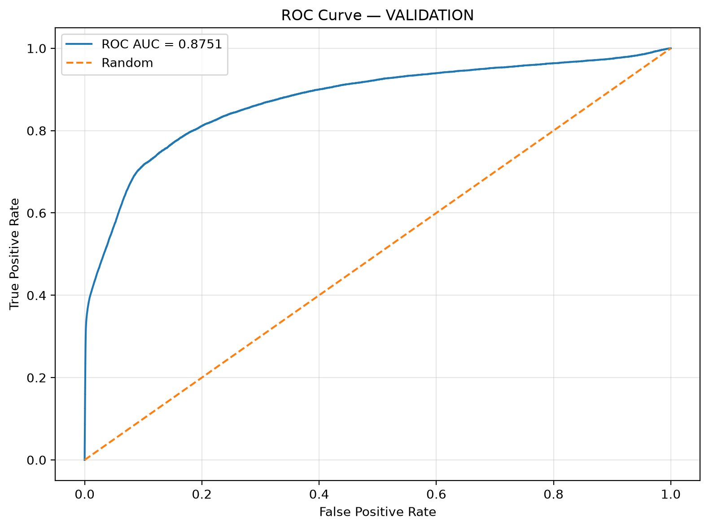
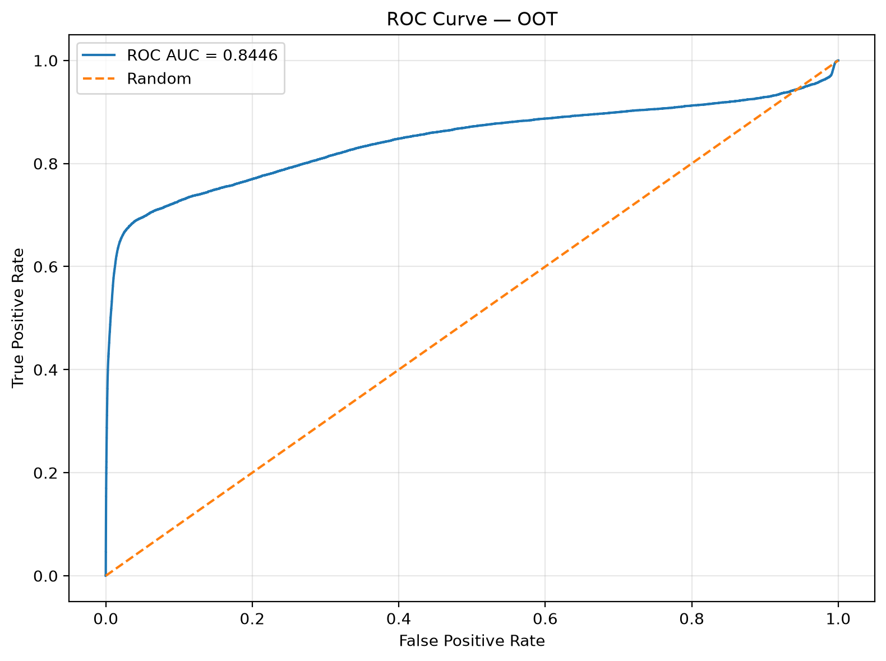
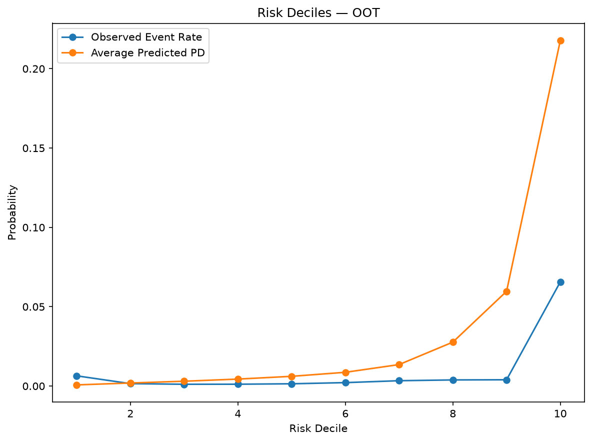
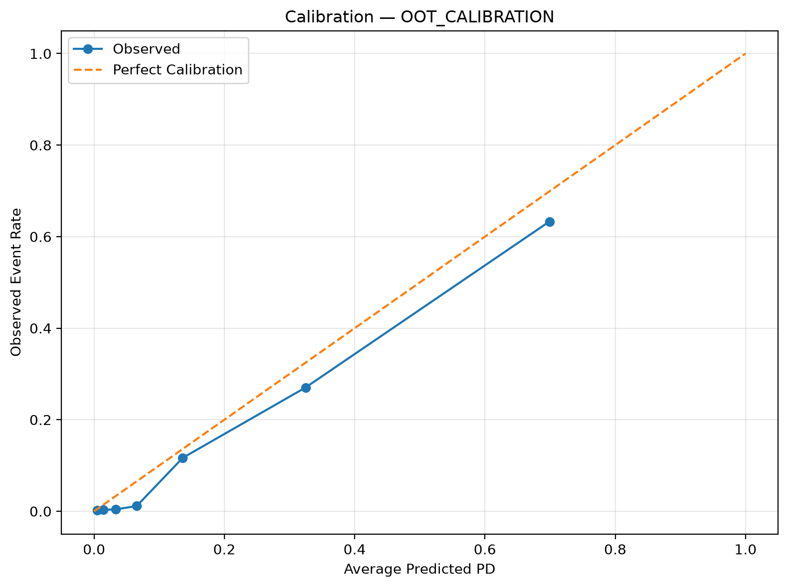

# Final Model Specification

## Overview

The final mortgage credit-risk model is the **GAM configuration `gam_macro_3_horizon`**. It is designed to estimate the probability that a mortgage will experience a **90+ days past due (90 DPD) event within the next 3 months**, using information available at the observation month.

The final model uses observations at **3, 6, 9, and 12 months of loan age** and combines origination characteristics, recent borrower/payment behaviour, delinquency trajectory signals, loan evolution variables, and macroeconomic conditions.

The modelling framework supports multiple algorithm choices; the final fitted artifact documented here uses a **Generalized Additive Model (GAM)** with nonlinear spline effects and selected pairwise interactions.

---

## 1. Model Definition

| Component | Final specification |
|---|---|
| Model version | `gam_macro_3_horizon` |
| Algorithm | GAM |
| Target | `future_90dpd` |
| Prediction horizon | 3 months |
| Observation ages | 3, 6, 9, 12 months |
| Training vintages | 2015–2020 |
| Validation | 20% stratified split within training data |
| Test vintage | 2021 |
| Out-of-time (OOT) vintage | 2022 |
| Random seed | 42 |
| Class weighting | Disabled |
| Numerical features | 54 |
| Categorical features | 12 |
| Total model features | 66 |
| GAM spline degree | 3 |
| GAM knots | 6 |
| Knot strategy | Quantile |
| GAM interactions | Enabled; 20 configured pairs |

The training artifact contains **43,114,736 training observations** and **15,827,668 validation observations**, with a training event rate of approximately **0.262%**.

---

## 2. Feature Architecture

The final model combines four broad information groups.

### Origination and structural risk

Examples include:

- `credit_score`
- `original_dti`
- `original_ltv`
- `original_cltv`
- `original_upb`
- `number_of_borrowers`
- `mi_percentage`
- `property_type`
- `occupancy_status`
- `loan_purpose`
- `channel`
- `property_state`

### Current loan state

Examples include:

- `current_actual_upb`
- `current_interest_rate`
- `estimated_ltv`
- `calculated_loan_age`
- `remaining_months_to_legal_maturity`
- `rate_change_from_origination`
- `upb_pct_change_from_origination`

### Behavioural and delinquency trajectory

The model explicitly incorporates both recent and cumulative behaviour, including:

- 3- and 12-month delinquency counts
- maximum delinquency severity
- delinquency streaks
- months since recent delinquency
- delinquency trend and acceleration
- delinquency severity change
- delinquency intensity change
- delinquency episode count
- relapse behaviour
- modification, payment-deferral and assistance-plan history
- disaster-related delinquency
- interest-rate step activity

This allows the model to distinguish a loan's **current state** from the **direction and persistence of deterioration**.

### Macroeconomic environment

The final GAM includes nonlinear effects for:

- `unemployment_rate`
- `mortgage_rate_30y`
- `hpi_purchase_only`
- `fed_funds_rate`

---

## 3. Nonlinear Effects

The GAM uses cubic splines with six quantile-based knots for selected variables where a linear relationship is not assumed.

The spline variables are:

```text
credit_score
original_dti
original_ltv
original_cltv
estimated_ltv
current_interest_rate
current_actual_upb
remaining_months_to_legal_maturity
dpd_trend_6m
dpd_acceleration_6m
dpd_severity_change_6m
current_delinquency_streak
max_delinquency_streak_12m
months_since_last_30dpd
months_since_last_60dpd
delinquency_intensity_change_6m
unemployment_rate
mortgage_rate_30y
hpi_purchase_only
fed_funds_rate
```

All other numerical variables use the default linear numerical effect unless otherwise specified by the model configuration.

---

## 4. GAM Interaction Structure

The final model enables 20 configured pairwise interactions. These are concentrated around the interaction between borrower credit quality, leverage, affordability, interest-rate pressure, and delinquency trajectory.

| # | Interaction |
|---:|---|
| 1 | `credit_score × estimated_ltv` |
| 2 | `credit_score × modification_flag` |
| 3 | `estimated_ltv × occupancy_status` |
| 4 | `dpd_trend_6m × property_type` |
| 5 | `dpd_trend_6m × dpd_acceleration_6m` |
| 6 | `original_dti × credit_score` |
| 7 | `dpd_trend_6m × estimated_ltv` |
| 8 | `dpd_acceleration_6m × estimated_ltv` |
| 9 | `dpd_trend_6m × credit_score` |
| 10 | `dpd_acceleration_6m × credit_score` |
| 11 | `dpd_severity_change_6m × credit_score` |
| 12 | `delinquency_intensity_change_6m × credit_score` |
| 13 | `dpd_severity_change_6m × estimated_ltv` |
| 14 | `delinquency_intensity_change_6m × estimated_ltv` |
| 15 | `current_delinquency_streak × estimated_ltv` |
| 16 | `original_dti × estimated_ltv` |
| 17 | `original_dti × original_ltv` |
| 18 | `current_interest_rate × original_dti` |
| 19 | `rate_change_from_origination × original_dti` |
| 20 | `rate_change_from_origination × estimated_ltv` |

These interactions allow the model to represent cases where the same behavioural signal has different risk implications depending on the borrower's credit quality, leverage, affordability, or loan characteristics.

---

## 5. Validation and Temporal Performance

### Validation — 2021 holdout

| Metric | Result |
|---|---:|
| ROC-AUC | **0.8751** |
| PR-AUC | **0.2199** |
| KS | **0.6197** |
| Log loss | **0.02511** |
| Brier score | **0.00464** |
| Precision | 51.04% |
| Recall | 19.33% |
| F1 | 0.2804 |
| Actual event rate | 0.516% |



### Out-of-time — 2022

The 2022 OOT evaluation provides the more important test of temporal robustness because it represents a genuinely later vintage and a materially different credit environment.

| Metric | Raw OOT | OOT after Beta calibration |
|---|---:|---:|
| ROC-AUC | **0.8446** | **0.8446** |
| PR-AUC | **0.4012** | **0.4012** |
| KS | **0.6485** | **0.6485** |
| Log loss | 0.05441 | **0.04079** |
| Brier score | 0.00998 | **0.00697** |
| Precision @ 0.10 | 8.29% | **26.11%** |
| Recall @ 0.10 | 71.13% | **63.43%** |
| F1 @ 0.10 | 0.1486 | **0.3699** |
| Actual event rate | 0.907% | 0.907% |
| Mean predicted probability | 3.436% | **2.188%** |



The ROC-AUC declines from **0.8751 on validation to 0.8446 OOT**, while KS remains strong at **0.6485**. This indicates some temporal degradation in ranking performance, but the model retains strong discriminatory power on the later vintage.

The substantially higher OOT PR-AUC reflects the higher 2022 event prevalence and should be interpreted in conjunction with the event rate rather than compared directly with validation without accounting for prevalence.

---

## 6. Risk Concentration and Portfolio Ranking

The model produces strong concentration of realised events in the highest-risk portion of the portfolio.

### OOT top-risk performance

| Portfolio fraction | Event capture | Precision | Lift |
|---:|---:|---:|---:|
| Top 5% | **69.16%** | 12.54% | **13.83×** |
| Top 10% | **72.39%** | 6.56% | **7.24×** |
| Top 20% | **76.75%** | 3.48% | **3.84×** |



The top 10% of the OOT population contains approximately **72.4% of realised events**, corresponding to **7.24× portfolio-average lift**. This demonstrates that the model is useful not only as a probability estimator but also as a portfolio-ranking mechanism for targeted risk management.

---

## 7. Probability Calibration

The raw GAM outputs are not assumed to be perfectly calibrated probabilities. On the 2022 OOT sample, the raw model has:

- Mean predicted probability: **3.436%**
- Actual event rate: **0.907%**
- Brier score: **0.00998**
- Log loss: **0.05441**
- ECE: **0.02529**
- MCE: **0.36435**

A **Beta calibration layer** is therefore applied to the OOT predictions. The calibration parameters stored in the final artifact are:

```text
a =  0.6845275107
b = -0.7356649810
c = -1.3849348277
```

After calibration:

- Mean predicted probability falls to **2.188%**.
- Log loss improves from **0.05441 → 0.04079**.
- Brier score improves from **0.00998 → 0.00697**.
- ECE improves to **0.01281**.
- MCE improves to **0.06596**.



Calibration materially improves probability quality while leaving ranking metrics unchanged, as expected from a post-hoc monotonic calibration layer.

Calibration is improved rather than perfect: the calibrated mean prediction remains above the observed OOT event rate, and non-zero ECE/MCE remains. This is therefore best interpreted as a **calibration improvement layer**, not evidence of perfect probability calibration.

---

## 8. Operating Threshold

A threshold of **0.10** is retained for the reported classification operating point.

On the OOT sample after calibration:

| Metric | Result |
|---|---:|
| Threshold | 0.10 |
| Precision | **26.11%** |
| Recall | **63.43%** |
| F1 | **0.3699** |
| True negatives | 1,525,663 |
| False positives | 25,484 |
| False negatives | 5,192 |
| True positives | 9,004 |

The threshold should be viewed as an **operating-policy choice**, not an intrinsic property of the model. In a production setting it would normally be tuned against the economic cost of missed defaults, false positives, intervention capacity, and portfolio constraints.

---

## 9. Model Governance and Reproducibility

The final artifact stores the model, preprocessing pipeline, training configuration, metadata, and evaluation outputs. The configuration records the exact training vintages, split strategy, random seed, model algorithm, GAM spline settings, interaction specification, and feature lists.

The modelling process is intentionally separated into:

1. **Point-in-time feature construction**
2. **Temporal train/validation/test/OOT evaluation**
3. **Model fitting**
4. **Ranking/discrimination assessment**
5. **Probability calibration**
6. **Threshold evaluation**

This separation is important for avoiding future-information leakage and for distinguishing ranking performance from probability calibration and downstream operating decisions.

---

## 10. Interpretation of the Final Results

The final model demonstrates three distinct strengths:

1. **Discrimination:** strong ranking performance is retained on the 2022 OOT vintage, with ROC-AUC **0.8446** and KS **0.6485**.
2. **Risk concentration:** the highest-risk 10% of the OOT portfolio captures approximately **72.4% of realised events**, with **7.24× lift**.
3. **Calibration improvement:** Beta calibration materially reduces log loss and Brier score, producing probabilities that are more suitable for downstream risk quantification than the raw model outputs.

The remaining calibration gap and the OOT deterioration relative to validation are important limitations rather than results to hide. They indicate that the model should be monitored over time and recalibrated or redeveloped when portfolio composition or the underlying economic regime changes materially.

---

## 11. Artifact Contents

The final model package contains:

```text
gam/
├── model.joblib/
├── preprocessor.joblib/
├── training_config.yaml
├── training_metadata.json
└── model_evaluation/
    ├── validation/
    ├── oot/
    └── oot_calibration/
```

The evaluation directories contain the corresponding metric JSON files, Excel evaluation reports, ROC/KS/calibration plots, risk-decile outputs, and the validation threshold summary.

---

## Related Documentation

- [`README.md`](../README.md)
- [`Modelling Methodology`](modelling-methodology.md)
- [`Project Flow`](project_flow.md)
- [`GAM Interactions`](gam_interactions.md)
- [`V1 → V2 Detailed Rationale`](V1_to_V2_detailed_rationale.md)
