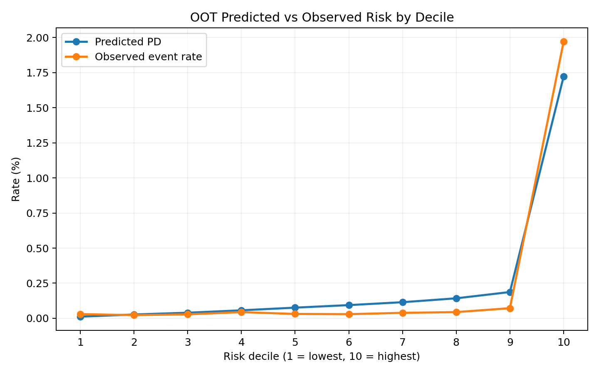

# Final Model Specification

## Overview

The final mortgage credit-risk model is the **HGAM configuration `gam_macro_3_horizon`**. It is designed to estimate the probability that a mortgage will experience a **90+ days past due (90 DPD) event within the next 3 months**, using information available at the observation month.

The final model uses observations at **3, 6, 9, and 12 months of loan age** and combines origination characteristics, recent borrower/payment behaviour, delinquency trajectory signals, loan evolution variables, and macroeconomic conditions.

The final fitted artifact documented here uses a **Hierarchical Generalized Additive Model (HGAM)** with nonlinear spline effects, selected pairwise interactions, state-level hierarchical effects, and group-varying smooths.

---

## 1. Model Definition

| Component | Final specification |
|---|---|
| Model version | `gam_macro_3_horizon` |
| Algorithm | Hierarchical GAM (HGAM) |
| Target | `future_90dpd` |
| Prediction horizon | 3 months |
| Observation ages | 3, 6, 9, 12 months |
| Training vintages | 2015–2020 |
| Validation | 20% stratified split within training data |
| Test vintage | 2021 |
| Out-of-time (OOT) vintage | 2022 |
| Random seed | 42 |
| Class weighting | Disabled |
| Numerical features | 54 |
| Categorical features | 12 |
| Total model features | 66 |
| GAM spline degree | 3 |
| GAM knots | 6 |
| Knot strategy | Quantile |
| GAM interactions | Enabled; 20 configured pairs |
| HGAM grouping | `property_state` |
| HGAM group intercept | Enabled |
| HGAM varying smooths | Enabled; 7 features |
| Hierarchical shrinkage | Enabled |

The training artifact contains **43,114,736 training observations** and **15,827,668 validation observations**, with a training event rate of approximately **0.262%**.

---

## 2. Feature Architecture

The final model combines four broad information groups.

### Origination and structural risk

Examples include:

- `credit_score`
- `original_dti`
- `original_ltv`
- `original_cltv`
- `original_upb`
- `number_of_borrowers`
- `mi_percentage`
- `property_type`
- `occupancy_status`
- `loan_purpose`
- `channel`
- `property_state`

### Current loan state

Examples include:

- `current_actual_upb`
- `current_interest_rate`
- `estimated_ltv`
- `calculated_loan_age`
- `remaining_months_to_legal_maturity`
- `rate_change_from_origination`
- `upb_pct_change_from_origination`

### Behavioural and delinquency trajectory

The model explicitly incorporates both recent and cumulative behaviour, including:

- 3- and 12-month delinquency counts
- maximum delinquency severity
- delinquency streaks
- months since recent delinquency
- delinquency trend and acceleration
- delinquency severity change
- delinquency intensity change
- delinquency episode count
- relapse behaviour
- modification, payment-deferral and assistance-plan history
- disaster-related delinquency
- interest-rate step activity

This allows the model to distinguish a loan's **current state** from the **direction and persistence of deterioration**.

### Macroeconomic environment

The final GAM includes nonlinear effects for:

- `unemployment_rate`
- `mortgage_rate_30y`
- `hpi_purchase_only`
- `fed_funds_rate`

---

## 3. Nonlinear Effects

The GAM uses cubic splines with six quantile-based knots for selected variables where a linear relationship is not assumed.

The spline variables are:

```text
credit_score
original_dti
original_ltv
original_cltv
estimated_ltv
current_interest_rate
current_actual_upb
remaining_months_to_legal_maturity
dpd_trend_6m
dpd_acceleration_6m
dpd_severity_change_6m
current_delinquency_streak
max_delinquency_streak_12m
months_since_last_30dpd
months_since_last_60dpd
delinquency_intensity_change_6m
unemployment_rate
mortgage_rate_30y
hpi_purchase_only
fed_funds_rate
```

All other numerical variables use the default linear numerical effect unless otherwise specified by the model configuration.

---

## 4. GAM Interaction Structure

The final model enables 20 configured pairwise interactions. These are concentrated around the interaction between borrower credit quality, leverage, affordability, interest-rate pressure, and delinquency trajectory.

| # | Interaction |
|---:|---|
| 1 | `credit_score × estimated_ltv` |
| 2 | `credit_score × modification_flag` |
| 3 | `estimated_ltv × occupancy_status` |
| 4 | `dpd_trend_6m × property_type` |
| 5 | `dpd_trend_6m × dpd_acceleration_6m` |
| 6 | `original_dti × credit_score` |
| 7 | `dpd_trend_6m × estimated_ltv` |
| 8 | `dpd_acceleration_6m × estimated_ltv` |
| 9 | `dpd_trend_6m × credit_score` |
| 10 | `dpd_acceleration_6m × credit_score` |
| 11 | `dpd_severity_change_6m × credit_score` |
| 12 | `delinquency_intensity_change_6m × credit_score` |
| 13 | `dpd_severity_change_6m × estimated_ltv` |
| 14 | `delinquency_intensity_change_6m × estimated_ltv` |
| 15 | `current_delinquency_streak × estimated_ltv` |
| 16 | `original_dti × estimated_ltv` |
| 17 | `original_dti × original_ltv` |
| 18 | `current_interest_rate × original_dti` |
| 19 | `rate_change_from_origination × original_dti` |
| 20 | `rate_change_from_origination × estimated_ltv` |

These interactions allow the model to represent cases where the same behavioural signal has different risk implications depending on the borrower's credit quality, leverage, affordability, or loan characteristics.

---

## 5. Hierarchical GAM Architecture

The final model extends the global GAM with hierarchical geographic structure using `property_state` as the grouping variable.

### Group-level intercept

A state-level hierarchical intercept allows baseline PD to vary across states rather than forcing a single global baseline risk.

### Group-varying smooths

The nonlinear relationship between selected risk drivers and PD is allowed to vary by state while retaining a shared global smooth. The configured varying smooths are:

```text
dpd_trend_6m
dpd_acceleration_6m
dpd_severity_change_6m
delinquency_intensity_change_6m
estimated_ltv
rate_change_from_origination
credit_score
```

### Hierarchical shrinkage

Group-specific deviations are subject to hierarchical shrinkage toward the shared global relationship. This provides a compromise between a single global GAM and completely independent state-level models, reducing the risk of unstable estimates in smaller groups.

The modelling motivation is that mortgage risk relationships can differ across local housing and economic markets. The same borrower deterioration, leverage, or credit-quality signal need not have identical implications for near-term default across states.

---

## 6. Validation and Temporal Performance

### Validation — 2021 holdout

| Metric | Result |
|---|---:|
| ROC-AUC | **0.9296** |
| PR-AUC | **0.5040** |
| KS | **0.7942** |
| Log loss | **0.00474** |
| Brier score | **0.00087** |
| Actual event rate | **0.132%** |
| Mean predicted probability | **0.124%** |
| Observed / expected ratio | **1.071** |
| ECE | **0.00059** |
| MCE | **0.20573** |


### Out-of-time — 2022

The 2022 OOT evaluation provides the more important test of temporal robustness because it represents a genuinely later vintage and a materially different credit environment.

| Metric | Final HGAM OOT |
|---|---:|
| ROC-AUC | **0.9258** |
| PR-AUC | **0.4605** |
| KS | **0.7874** |
| Log loss | **0.00814** |
| Brier score | **0.00159** |
| Actual event rate | **0.231%** |
| Mean predicted probability | **0.247%** |
| Observed / expected ratio | **0.935** |
| ECE | **0.00094** |
| MCE | **0.09240** |

The final HGAM retains strong discrimination from validation to OOT, with ROC-AUC **0.9296 → 0.9258** and KS **0.7942 → 0.7874**. The relatively small change across the temporal split provides evidence of strong temporal transportability.

The OOT PR-AUC should still be interpreted together with the underlying event prevalence.


## 7. Risk Concentration and Portfolio Ranking

The model produces strong concentration of realised events in the highest-risk portion of the portfolio.

### OOT top-risk performance

| Portfolio fraction | Event capture | Precision | Lift |
|---:|---:|---:|---:|
| Top 5% | **82.70%** | 3.82% | **16.54×** |
| Top 10% | **85.29%** | 1.97% | **8.53×** |
| Top 20% | **88.41%** | 1.02% | **4.42×** |


The top 10% of the OOT population contains approximately **85.3% of realised events**, corresponding to **8.53× portfolio-average lift**. This demonstrates strong concentration of realised events in the highest-risk portion of the portfolio and supports use for targeted risk management.

## 8. Native Probability Quality

The final HGAM retains its **native/raw predicted probabilities** and does not apply a post-hoc calibration layer.

On the 2022 OOT sample:

- Mean predicted probability: **0.247%**
- Actual event rate: **0.231%**
- Observed / expected ratio: **0.935**
- Brier score: **0.00159**
- Log loss: **0.00814**
- ECE: **0.00094**
- MCE: **0.09240**

The aggregate probability scale is substantially closer to realised event frequency than the earlier GAM benchmark. The risk-decile results also show sensible ordering and a close relationship between predicted and realised risk in the highest-risk decile.

The decision to retain native probabilities is deliberate: the raw HGAM already provides strong probability behaviour OOT, so an additional post-hoc calibration layer is not required for the final Phase 1 model.




## 9. Operating Threshold

A threshold of **0.26** is retained for the reported final HGAM classification operating point.

On the 2022 OOT sample:

| Metric | Result |
|---|---:|
| Threshold | 0.26 |
| Precision | **60.73%** |
| Recall | **43.43%** |
| F1 | **0.5064** |
| True negatives | 6,125,853 |
| False positives | 3,987 |
| False negatives | 8,031 |
| True positives | 6,165 |

The threshold should be viewed as an **operating-policy choice**, not an intrinsic property of the model. In a production setting it would normally be tuned against the economic cost of missed defaults, false positives, intervention capacity, and portfolio constraints.

## 10. Model Governance and Reproducibility

The final artifact stores the model, preprocessing pipeline, training configuration, metadata, and evaluation outputs. The configuration records the exact training vintages, split strategy, random seed, model algorithm, GAM spline settings, interaction specification, and feature lists.

The modelling process is intentionally separated into:

1. **Point-in-time feature construction**
2. **Temporal train/validation/test/OOT evaluation**
3. **Model fitting**
4. **Ranking/discrimination assessment**
5. **Native probability quality assessment**
6. **Threshold evaluation**

This separation is important for avoiding future-information leakage and for distinguishing ranking performance from probability calibration and downstream operating decisions.

---

## 11. Interpretation of the Final Results

The final model demonstrates four distinct strengths:

1. **Discrimination:** the HGAM achieves ROC-AUC **0.9258**, PR-AUC **0.4605**, and KS **0.7874** on the 2022 OOT vintage.
2. **Risk concentration:** the highest-risk 10% of the OOT population captures approximately **85.3% of realised events**, with **8.53× lift**.
3. **Native probability quality:** the mean predicted PD (**0.247%**) is close to the observed event rate (**0.231%**), producing an observed/expected ratio of **0.935** without post-hoc calibration.
4. **Hierarchical modelling:** the HGAM allows geographic risk heterogeneity through a state-level group effect and group-varying smooths while retaining shared global nonlinear structure.

The model's strong OOT performance indicates that the hierarchical extension captures useful geographic heterogeneity while preserving the underlying behavioural and macroeconomic structure of the GAM.

The remaining local calibration gaps are an important limitation rather than a result to hide. The aggregate native probability scale is strong, but monitoring remains appropriate as portfolio composition and the underlying economic regime change materially.

## 12. Artifact Contents

The final model package contains:

```text
gam/
├── model.joblib/
├── preprocessor.joblib/
├── training_config.yaml
├── training_metadata.json
└── model_evaluation/
    ├── validation/
    └── oot/
```

The evaluation directories contain the corresponding metric JSON files, Excel evaluation reports, ROC/KS/calibration plots, risk-decile outputs, and the validation threshold summary.

---

## Related Documentation

- [`README.md`](../README.md)
- [`Modelling Methodology`](modelling-methodology.md)
- [`Project Flow`](project_flow.md)
- [`GAM Interactions`](gam_interactions.md)
- [`V1 → V2 Detailed Rationale`](V1_to_V2_detailed_rationale.md)
