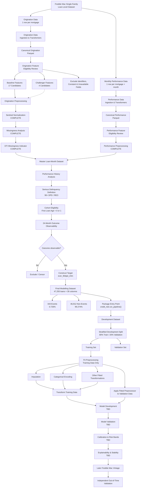

# Mortgage Credit Risk — Project Flow

This document tracks the end-to-end development of the mortgage credit-risk
modelling framework. The flow is updated as each stage of the project is
completed.



## Current Status

| Stage | Status |
|---|---|
| Data ingestion | Complete |
| Canonical transformations | Complete |
| Schema validation | Complete |
| Performance-data investigation | Complete |
| Target definition | Complete |
| Cohort construction | Complete |
| Target validation | Complete |
| Origination feature eligibility | Complete |
| Performance feature eligibility | Complete |
| Sentinel normalization | Complete |
| Missingness analysis | Complete |
| DTI missingness indicator | Complete |
| Origination preprocessing | Complete |
| Performance preprocessing | Complete |
| Master loan-month integration | Complete |
| Final modelling dataset construction | Complete |
| End-to-end `run_pipeline()` integration | **Complete** |
| Development / validation strategy | Complete |
| Development split implementation | **Not started** |
| Fitted preprocessing | Not started |
| Model development | Not started |
| Model validation | Not started |
| Calibration | Not started |
| Explainability and stability | Not started |
| Independent out-of-time validation | Future phase |

## Current Pipeline

The end-to-end data pipeline is exposed through the package-level entry point:

```python
from credit_risk import run_pipeline

modeling_df = run_pipeline(2015)
```

The pipeline currently executes:

```text
Raw Freddie Mac Data
        ↓
Ingestion & Transformers
        ↓
Canonical Origination + Performance Data
        ↓
Origination + Performance Preprocessing
        ↓
Master Loan-Month Dataset
        ↓
24-Month Serious-Delinquency Target
        ↓
Final Loan-Level Modelling Dataset
```

### Validated Pipeline Output

The integrated 2015 pipeline produces:

| Metric | Value |
|---|---:|
| Final modelling rows | 47,255 |
| Unique loans | 47,255 |
| Duplicate loan IDs | 0 |
| Dataset columns | 30 |
| Serious-delinquency events | 343 |
| Non-events | 46,912 |
| Event rate | 0.726% |

The final modelling dataset therefore has exactly one row per eligible loan.

## Current Phase

The complete data-construction pipeline is now operational and validated.

The project is transitioning from **data pipeline development** to
**development-split implementation**.

The current development population will be divided using an approximately
80% / 20% stratified training and validation split.

All transformations that learn parameters from data will subsequently be
fitted on the training population only.

This includes:

- numerical imputation,
- categorical encoding,
- scaling where required,
- feature-selection statistics,
- and other fitted preprocessing transformations.

The validation population will not contribute information to fitted
preprocessing or model estimation.

A later Freddie Mac origination vintage will eventually provide an
independent out-of-time validation population.