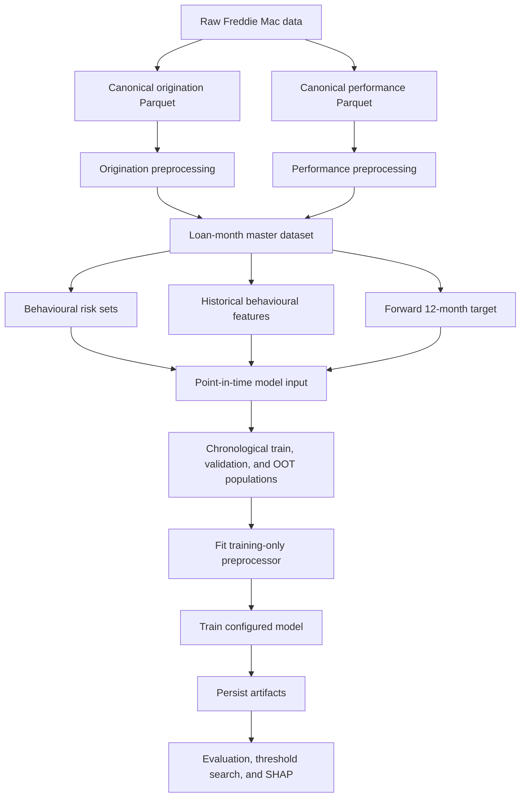

# Mortgage Credit Risk — Project Flow

## V2 architecture



This document describes V2 only. Its active configuration selects `behavioral` and PySpark, trains on 2015–2018, validates on 2019–2020, and holds 2021–2022 out of time. Behavioural parameters specify observation ages 6 and 12 and a 12-month forward horizon. V3 documentation is maintained separately.

## Stage status

| Stage | Status |
|---|---|
| Ingestion, validation, and canonical datasets | Implemented |
| Pandas and PySpark behavioural preprocessing | Implemented |
| Point-in-time risk-set and target construction | Implemented |
| Group-safe and chronological splits | Implemented |
| Logistic regression, random forest, LightGBM, and XGBoost | Implemented |
| Versioned artifacts, reports, and XGBoost SHAP | Implemented |
| Probability calibration and stability monitoring | Future work |
| PySpark origination-target construction | Not implemented |

## Leakage and observability

The model input is one row per `loan_id × observation_age`. An eligible loan has an exact observation, no prior serious delinquency, and no termination at the observation age. Features use information known at or before that month; later performance is used only for the target.

The forward outcome is observable when the full horizon is available, an event is observed, or a voluntary payoff (`ZBC = 01`) occurs. Other early exits without an event are excluded.

## Configuration and execution

| Section | Controls |
|---|---|
| `modelling_approach` / `engine` | Dataset grain and processing engine |
| `data` | Provider, vintages, source fields, and stage switches |
| `behavioral` | Observation ages and prediction horizon |
| `target` | Event definition and payoff handling |
| `modelling` | Vintages, split, feature contract, algorithm, hyperparameters |
| `evaluation` | Datasets, threshold selection, deciles, calibration, and SHAP |

Numeric features are median-imputed; categorical features are filled with `Unknown`, one-hot encoded, and tolerate unseen categories. The preprocessor is fitted on training data only and persisted with the model.

```python
from pathlib import Path
from credit_risk import run_pipeline

run_pipeline(Path("."))
```

Enable only stages whose upstream data or artifacts exist. The checked-in configuration reuses existing model inputs by skipping ingestion and preprocessing.
