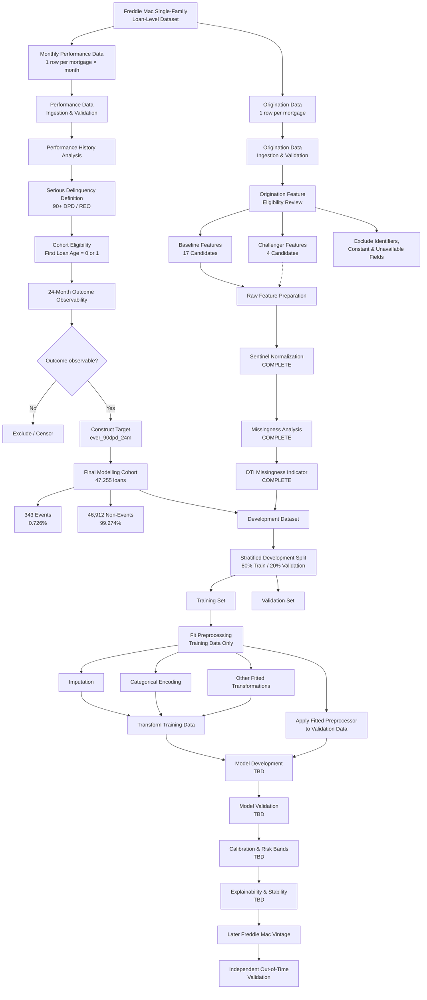

# Mortgage Credit Risk — Project Flow

This document tracks the end-to-end development of the mortgage credit-risk
modelling framework. The flow is updated as each stage of the project is
completed.

## Current Status

| Stage | Status |
|---|---|
| Data ingestion | Complete |
| Schema validation | Complete |
| Performance-data investigation | Complete |
| Target definition | Complete |
| Cohort construction | Complete |
| Target validation | Complete |
| Origination feature eligibility | Complete |
| Sentinel normalization | Complete |
| Missingness analysis | Complete |
| DTI missingness indicator | Complete |
| Development / validation strategy | **Complete** |
| Development split implementation | **Not started** |
| Fitted preprocessing | Not started |
| Model development | Not started |
| Model validation | Not started |
| Calibration | Not started |
| Explainability and stability | Not started |
| Independent out-of-time validation | Future phase |

## Current Phase

The project is currently transitioning from **raw feature preparation**
to **development-split implementation**.

Feature eligibility and raw missing-value handling rules have been established.

The current development population will be divided using an approximately
80% / 20% stratified training and validation split.

All transformations that learn parameters from data will subsequently be
fitted on the training population only.

This includes:

- numerical imputation,
- categorical encoding,
- scaling where required,
- feature-selection statistics,
- and other fitted preprocessing transformations.

The validation population will not contribute information to fitted
preprocessing or model estimation.

A later Freddie Mac origination vintage will eventually provide an
independent out-of-time validation population.