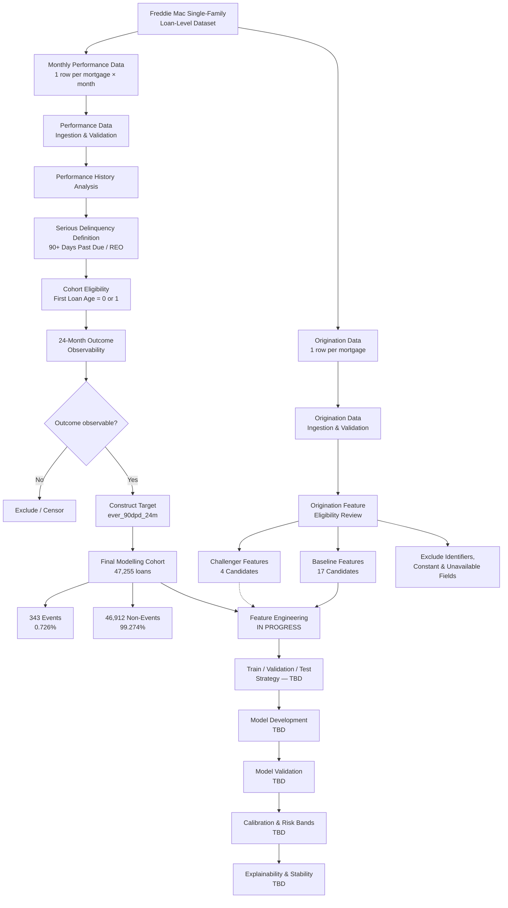

# Mortgage Credit Risk — Project Flow

This document tracks the end-to-end development of the mortgage credit-risk
modelling framework. The flow is updated as each stage of the project is
completed.

## Current Status

| Stage | Status |
|---|---|
| Data ingestion | Complete |
| Schema validation | Complete |
| Performance-data investigation | Complete |
| Target definition | Complete |
| Cohort construction | Complete |
| Target validation | Complete |
| Origination feature eligibility | **Complete** |
| Feature engineering | **In progress** |
| Train / validation / test design | Not started |
| Model development | Not started |
| Model validation | Not started |
| Calibration | Not started |
| Explainability and stability | Not started |

## Current Phase

The project is currently in the **Feature Engineering** phase.

The eligible information set for the baseline model has been established
through the Origination Feature Eligibility Review.

The baseline feature set contains 17 candidate predictors spanning:

- borrower credit quality and repayment capacity,
- collateral and leverage,
- loan structure,
- refinance-program characteristics,
- and broad property geography.

High-cardinality, sparse, or potentially unstable variables have been
separated into a challenger feature set rather than automatically included
in the baseline model.

Feature engineering will now convert the eligible raw origination fields
into a reproducible modelling dataset while preserving their economic and
credit-risk meaning.