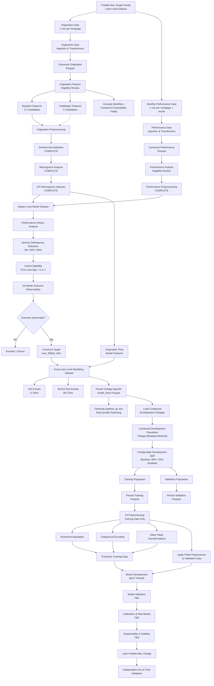

# Mortgage Credit Risk — Project Flow

This document tracks the end-to-end development of the mortgage credit-risk
modelling framework. The flow is updated as each stage of the project is
completed.



## Current Status

| Stage | Status |
|---|---|
| Data ingestion | Complete |
| Canonical transformations | Complete |
| Schema validation | Complete |
| Performance-data investigation | Complete |
| Target definition | Complete |
| Cohort construction | Complete |
| Target validation | Complete |
| Origination feature eligibility | Complete |
| Performance feature eligibility | Complete |
| Sentinel normalization | Complete |
| Missingness analysis | Complete |
| DTI missingness indicator | Complete |
| Origination preprocessing | Complete |
| Performance preprocessing | Complete |
| Master loan-month integration | Complete |
| Final modelling dataset construction | Complete |
| Data-quality reporting workbook | Complete |
| Multi-vintage modelling-data loader | **Complete** |
| Development / validation strategy | Complete |
| Stratified development split | **Complete** |
| Training / validation persistence | **Complete** |
| Modelling-pipeline orchestration | **Complete** |
| End-to-end pipeline integration | **Complete** |
| Modelling loader unit tests | **Complete** |
| Development split unit tests | **Complete** |
| Modelling pipeline tests | **Complete** |
| End-to-end pipeline validation | **Complete** |
| Fitted preprocessing | **Not started — Next phase** |
| Model development | Not started |
| Model validation | Not started |
| Calibration | Not started |
| Explainability and stability | Not started |
| Independent out-of-time validation | Future phase |

## Current Pipeline

The end-to-end pipeline is exposed through the package-level entry point:

```python
from pathlib import Path
from credit_risk import run_pipeline

run_pipeline(Path("."))
```

The pipeline is configuration-driven and orchestrates the currently enabled
data-construction, reporting, and modelling-data preparation stages.

The current architecture separates two concepts:

- the **data vintage** being constructed by the current pipeline execution;
- the **development vintages** consumed by the modelling stage.

This allows individual vintages to be constructed independently while the
modelling layer can subsequently combine multiple persisted vintage-specific
model inputs.

The pipeline currently executes:

```text
Raw Freddie Mac Data
        ↓
Ingestion & Transformers
        ↓
Canonical Origination + Performance Data
        ↓
Origination + Performance Preprocessing
        ↓
Master Loan-Month Dataset
        ↓
24-Month Serious-Delinquency Target
        ↓
Origination-Time Features + Target
        ↓
Vintage-Specific model_input
        ↓
Data-Quality Reporting
        ↓
Load Configured Development Vintages
        ↓
Combined Development Population
        ↓
Stratified Development Split
        ↓
┌────────────────────┬────────────────────┐
│                    │                    │
▼                    ▼
Training Population  Validation Population
│                    │
▼                    ▼
Persist              Persist
```

## Modelling Population Architecture

### Vintage-Specific Model Inputs

Each data vintage produces its own loan-level modelling dataset.

Conceptually:

```text
2015
  ↓
model_input/2015

2016
  ↓
model_input/2016

2017
  ↓
model_input/2017
```

Each persisted model-input dataset contains:

- one row per eligible loan,
- origination-time model information,
- and the serious-delinquency target.

Performance information is used to construct the target but is not carried
into the baseline origination-time predictor set.

### Multi-Vintage Development Population

The modelling layer can load one or more persisted model-input vintages.

For example:

```yaml
modelling:
  vintages_train:
    - 2015
```

can later become:

```yaml
modelling:
  vintages_train:
    - 2015
    - 2016
    - 2017
```

without changing the underlying model-input construction logic.

The selected vintages are concatenated into an in-memory development
population.

A `vintage` column is retained as metadata to support:

- population reconciliation,
- vintage-level diagnostics,
- stability analysis,
- and future temporal validation.

The loader validates the development population before it proceeds,
including protection against duplicate loan identifiers across vintages.

## Development Split

The combined development population is divided into:

- a **training population**, and
- a **validation population**.

The baseline configuration uses an approximately:

```text
80% Training
20% Validation
```

split.

The split is stratified on:

```text
ever_90dpd_24m
```

so that the rare serious-delinquency event rate is approximately preserved
across both populations.

The split behavior is configuration-driven, including:

- validation size,
- random state,
- and whether stratification is enabled.

The implementation validates:

- target-column availability,
- target missingness,
- target class availability,
- and validation-size bounds.

A fixed random state makes the split reproducible for an unchanged input
population and configuration.

## Training and Validation Persistence

The resulting training and validation populations are persisted as separate
modelling artifacts.

This serves a different purpose from the in-memory return of individual
modelling utilities.

Persistence provides:

- reproducible population assignment,
- stable downstream model-development inputs,
- easier debugging and reconciliation,
- and separation between data construction and subsequent model experiments.

The combined multi-vintage development population itself does not need to be
persisted because it can be reconstructed from the underlying vintage-specific
model-input artifacts.

Routine reruns with an unchanged development population and split
configuration reproduce the same split.

A new development-dataset version should be created when the population or
split methodology changes materially rather than for every pipeline
execution.

Examples include changes to:

- training vintages,
- cohort eligibility,
- target definition,
- validation fraction,
- random state,
- or splitting strategy.

## Latest Persisted 2015 Model Input

The validated 2015 modelling population contains:

| Metric | Value |
|---|---:|
| Final modelling rows | 47,255 |
| Unique loans | 47,255 |
| Duplicate loan IDs | 0 |
| Serious-delinquency events | 343 |
| Non-events | 46,912 |
| Event rate | 0.726% |

The final modelling dataset therefore contains exactly one row per eligible
loan.

The exact persisted column count should be treated as an artifact-level
property and revalidated whenever the modelling schema changes rather than
being hard-coded into the methodology.

## Testing State

The modelling-data preparation layer is covered at three levels.

### Modelling Data Loader

Unit tests cover:

- loading a single vintage,
- loading multiple vintages,
- retaining vintage metadata,
- rejecting an empty vintage list,
- detecting duplicate loan identifiers,
- preserving the original persisted vintage artifacts,
- and validating compatible modelling schemas.

### Development Split

Unit tests cover:

- expected training and validation sizes,
- preservation of the target event rate through stratification,
- absence of loan overlap,
- complete population reconciliation,
- deterministic splitting with a fixed random state,
- optional non-stratified splitting,
- missing target columns,
- missing target values,
- invalid validation sizes,
- and single-class targets.

### Modelling Pipeline

Pipeline-level tests verify orchestration rather than retesting the underlying
loader and split algorithms.

They cover:

- loading the configured training vintages,
- passing the loaded development population to the split stage,
- resolving the correct training and validation output paths,
- persisting both populations,
- and performing no modelling work when the modelling pipeline is skipped.

The full pipeline has also been executed successfully end to end following
the modelling-stage integration.

## Current Phase

The project has completed the **development-population construction and
splitting phase**.

The current boundary is:

```text
Data Construction                         COMPLETE
        ↓
Target Construction                       COMPLETE
        ↓
Data-Quality Reporting                    COMPLETE
        ↓
Vintage-Specific Model Inputs             COMPLETE
        ↓
Multi-Vintage Development Loading         COMPLETE
        ↓
Train / Validation Split                  COMPLETE
        ↓
Train / Validation Persistence            COMPLETE
        ↓
Fitted Preprocessing                      NEXT
```

The project is therefore transitioning from **modelling-data preparation**
to **fitted preprocessing**.

## Next Phase — Fitted Preprocessing

All transformations that learn parameters from data will be fitted using
the training population only.

This includes:

- numerical imputation,
- categorical encoding,
- scaling where required,
- feature-selection statistics,
- and other fitted preprocessing transformations.

The fitted preprocessing objects will then be applied unchanged to the
validation population.

The intended flow is:

```text
Training Population
        ↓
Fit Preprocessor
        ↓
┌──────────────────────────────┐
│ Numerical Imputation         │
│ Categorical Treatment        │
│ Encoding                     │
│ Other Fitted Transformations │
└──────────────────────────────┘
        ↓
Transform Training Population
        │
        │ fitted preprocessor
        ▼
Transform Validation Population
```

The validation population will not contribute information to fitted
preprocessing or model estimation.

Metadata such as:

```text
loan_id
vintage
```

and the target:

```text
ever_90dpd_24m
```

will be separated from the predictor matrix before model fitting.

## Future Model Development

Once fitted preprocessing is complete, the project will proceed to:

```text
Fitted Preprocessing
        ↓
Baseline Model Development
        ↓
Model Validation
        ↓
Calibration & Risk Bands
        ↓
Explainability
        ↓
Stability Analysis
        ↓
Later Freddie Mac Vintage
        ↓
Independent Out-of-Time Validation
```

A later Freddie Mac origination vintage will provide an independent
out-of-time population.

That population will remain completely outside:

- preprocessing estimation,
- model fitting,
- hyperparameter selection,
- feature-selection decisions,
- and development-threshold selection.

It will therefore provide the final test of temporal generalization for the
baseline mortgage credit-risk framework.