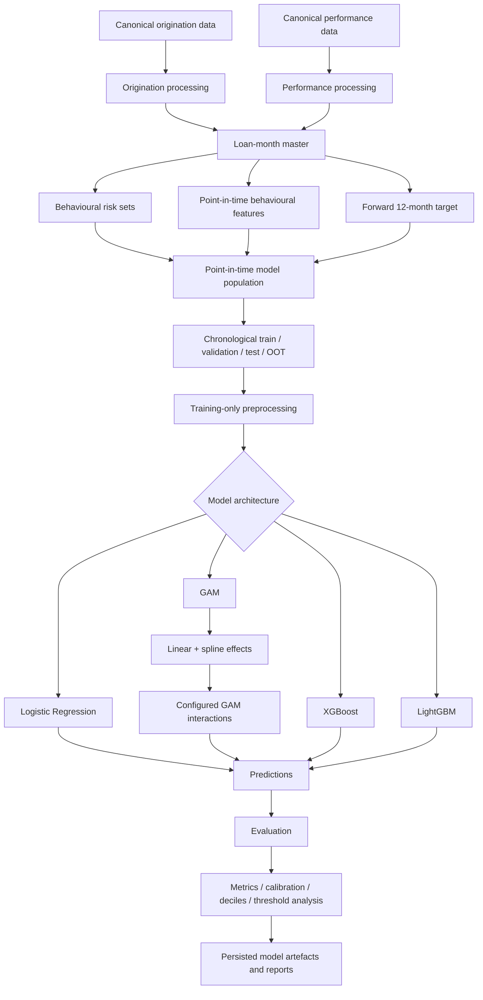

# Mortgage Credit Risk — Project Flow

## 1. Project architecture

The mortgage credit-risk pipeline is a **configuration-driven, point-in-time modelling framework**.

The data preparation, behavioural feature engineering, target construction, leakage controls, temporal population design, and evaluation framework are shared across model architectures.

The modelling layer is **toggleable** through configuration.

Supported model architectures are:

* **Logistic Regression**
* **Generalized Additive Model (GAM)**
* **XGBoost**
* **LightGBM**

The active algorithm is selected through the modelling configuration.

```yaml
modelling:
  algorithm: gam
```

The architecture is therefore:



The important design principle is:

```text
                    SHARED PIPELINE
                         │
                         ▼
             Point-in-time model input
                         │
                         ▼
               Training-only transforms
                         │
                         ▼
                ┌────────────────────┐
                │  MODEL SELECTION   │
                └────────────────────┘
                  │    │    │    │
                  ▼    ▼    ▼    ▼
                  LR  GAM  XGB  LGBM
                  │    │    │    │
                  └────┴────┴────┘
                         │
                         ▼
                    Evaluation
```

Changing the selected model architecture should not require changing the underlying behavioural target or point-in-time feature definition.

---

## 2. Data and modelling stages

| Stage                              | Purpose                                                               |
| ---------------------------------- | --------------------------------------------------------------------- |
| Canonical origination data         | Standardised origination-level loan information                       |
| Canonical performance data         | Standardised monthly performance history                              |
| Loan-month master                  | Combined monthly loan state and longitudinal performance history      |
| Behavioural risk sets              | Identify eligible loan observations at configured ages                |
| Point-in-time feature construction | Build predictors using information available at the observation point |
| Target construction                | Construct the forward 12-month serious-delinquency/REO outcome        |
| Population split                   | Create chronological training, validation, test and OOT populations   |
| Training-only preprocessing        | Fit imputation/encoding/transformation state using training data only |
| Model selection                    | Select Logistic Regression, GAM, XGBoost or LightGBM                  |
| Model-specific transformation      | Apply architecture-specific representation where required             |
| Model fitting                      | Train the selected architecture on the training population            |
| Persistence                        | Save model, preprocessing state, configuration and metadata           |
| Evaluation                         | Measure discrimination, calibration, ranking and temporal stability   |
| Reporting                          | Persist metrics, charts, deciles, calibration and threshold outputs   |

The model-specific stage is intentionally separated from the upstream data and risk-set construction.

---

## 3. Observation framework

The active behavioural configuration creates observations at:

```text
2, 4, 6, 8, 10, 12 months
```

Each model observation has the grain:

```text
loan_id × observation_age
```

For example:

```text
Loan A × age 2
Loan A × age 4
Loan A × age 6
Loan A × age 8
...
```

These are distinct point-in-time risk observations.

The active prediction horizon is:

```text
12 months forward
```

Therefore, an observation at age `t` uses:

```text
Information through t
        ↓
    predictors
```

and:

```text
Information after t
        ↓
     future outcome
```

The fundamental information boundary is:

```text
                         OBSERVATION POINT
                                │
                ┌───────────────┴───────────────┐
                │                               │
        Information ≤ t                  Information > t
                │                               │
                ▼                               ▼
           PREDICTORS                         TARGET
```

This point-in-time boundary is maintained independently of which model architecture is selected.

---

## 4. Target construction

The active target is:

```text
future_90dpd_12m
```

For an eligible observation at age `t`, the target examines the following 12 months:

```text
t + 1 ... t + 12
```

The target is positive when the loan experiences:

* numeric delinquency status `>= 3`, approximately 90+ DPD; or
* REO acquisition status `RA`.

Conceptually:

```text
Observation at t
       │
       ├── t + 1
       ├── t + 2
       ├── ...
       └── t + 12
              │
              ▼
       Serious event?
          │       │
         Yes      No
          │       │
          ▼       ▼
        Event   Non-event
```

Voluntary payoff/maturity (`ZBC = 01`) without a prior serious event is handled as a non-event according to the target rules.

Other incomplete early exits are handled according to the target-observability rules.

---

## 5. Leakage control

The pipeline enforces a strict temporal separation between predictors and outcomes.

Features may use:

```text
origination information
+
performance history through t
+
current loan state at t
+
behavioural history through t
+
macro information available for the observation period
```

They may not use:

```text
performance information after t
```

The target alone uses the forward period.

Conceptually:

```text
                    LOAN HISTORY
──────────────────────────────────────────────────────► TIME

        FEATURES                         TARGET
           │                               │
           │                               │
           ▼                               ▼
───────────●───────────────────────────────●───────────
         age t                         t + 12
           │
           │
           └──── predictors stop here
```

This leakage boundary applies to every model architecture.

In particular, model-specific preprocessing or learned transformations must not use validation, test or OOT information.

---

## 6. Temporal populations

The active configuration separates the vintages as:

```text
2015–2020
    │
    └── Training population
            │
            └── configured 20% chronological/yearly validation split

2021
    │
    └── Test population

2022
    │
    └── Out-of-time population
```

The conceptual evaluation hierarchy is:

```text
Training
   ↓
Validation
   ↓
Test
   ↓
OOT
```

The OOT population is reserved for assessing temporal robustness.

It must not be used to fit:

* imputers;
* categorical encoders;
* spline knots;
* GAM interaction state;
* model coefficients;
* tree-model parameters;
* other learned preprocessing state.

---

## 7. Shared preprocessing layer

Before entering the selected model architecture, the model population passes through the configured training-only preprocessing framework.

Conceptually:

```text
Point-in-time model input
          ↓
Training population
          ↓
Fit preprocessing
          ↓
Persist transformation state
          ↓
Transform validation/test/OOT
```

Typical transformations include:

```text
Numerical
    → missing-value treatment / median imputation

Categorical
    → Unknown handling
    → categorical encoding
```

The exact transformation behaviour is controlled by the project configuration and model implementation.

The key requirement is that the transformation state is learned from training data and reused unchanged for later populations.

---

## 8. Toggleable model architecture

The pipeline supports four model choices:

```text
                    MODEL SELECTOR
                         │
        ┌────────────────┼────────────────┐
        │                │                │
        ▼                ▼                ▼
 Logistic Regression    GAM             XGBoost
                                         │
                                         │
                                         ▼
                                      LightGBM
```

The selected model is controlled through:

```yaml
modelling:
  algorithm: <selected_model>
```

The same point-in-time model population can therefore be evaluated under different modelling assumptions.

### Logistic Regression

Provides a simple linear baseline:

```text
logit(PD)
    =
intercept
+
Σ βj Xj
```

This provides an interpretable benchmark against which nonlinear models can be compared.

### GAM

Provides controlled nonlinear modelling:

```text
logit(PD)
    =
intercept
+
Σ fj(Xj)
+
Σ hm(Xa, Xb)
```

The GAM can use:

* linear numerical effects;
* selected spline effects;
* categorical effects;
* explicitly configured interactions.

### XGBoost

Provides a nonlinear tree-based gradient-boosting architecture capable of modelling:

* nonlinear relationships;
* feature interactions;
* threshold effects;
* heterogeneous risk patterns.

### LightGBM

Provides another nonlinear tree-based gradient-boosting architecture, allowing comparison against XGBoost under the same point-in-time feature and evaluation framework.

---

## 9. GAM-specific execution path

The GAM path introduces additional model-specific transformations that do not apply to the other model architectures.

```text
Point-in-time features
        ↓
Training-only preprocessing
        ↓
Linear numerical effects
        +
Spline-eligible numerical effects
        +
Categorical effects
        ↓
Configured GAM interactions
        ↓
VectorAssembler
        ↓
Logistic Regression
        ↓
GAM prediction
```

The active GAM configuration uses:

```text
Spline degree = 3
Number of knots = 6
Knot method = quantile
```

Numerical features are linear by default.

Configured spline-eligible features can receive nonlinear spline representations.

If a feature does not have sufficient valid/unique values to construct the requested spline representation, it can fall back to a linear representation rather than causing model fitting to fail.

---

## 10. GAM interactions

GAM interactions are controlled through configuration rather than generated exhaustively.

The supported interaction concepts are:

```text
Numeric × Numeric
        ↓
Tensor-product spline interaction

Numeric × Categorical
        ↓
Varying-effect interaction
```

Categorical × categorical interactions are not part of the controlled interaction framework.

The interaction stage is therefore only activated when:

```yaml
interactions:
  enabled: true
```

The architecture becomes:

```text
GAM main effects
      │
      ├── linear numerical effects
      ├── spline effects
      └── categorical effects
              +
      configured interactions
              │
              ▼
       VectorAssembler
              │
              ▼
      Logistic Regression
```

The detailed interaction architecture is documented separately in:

```text
docs/gam_interactions.md
```

---

## 11. Model-specific versus shared components

The architecture intentionally separates common pipeline components from model-specific components.

| Component                   | Logistic Regression |        GAM |  XGBoost | LightGBM |
| --------------------------- | ------------------: | ---------: | -------: | -------: |
| Point-in-time target        |                 Yes |        Yes |      Yes |      Yes |
| Behavioural features        |                 Yes |        Yes |      Yes |      Yes |
| Temporal split              |                 Yes |        Yes |      Yes |      Yes |
| Training-only preprocessing |                 Yes |        Yes |      Yes |      Yes |
| Linear effects              |                 Yes |        Yes | Implicit | Implicit |
| Spline effects              |                  No |        Yes |       No |       No |
| Configured GAM interactions |                  No |        Yes |       No |       No |
| Tree-based interactions     |                  No | Controlled |      Yes |      Yes |
| Shared evaluation framework |                 Yes |        Yes |      Yes |      Yes |
| OOT evaluation              |                 Yes |        Yes |      Yes |      Yes |

This separation allows model comparisons to focus on the effect of the modelling architecture rather than changing the underlying risk population.

---

## 12. Configuration

The principal configuration files are:

| File                                | Role                                                                                                            |
| ----------------------------------- | --------------------------------------------------------------------------------------------------------------- |
| `config/parameters/base.yml`        | Pipeline settings, model selection, temporal splits, GAM configuration, evaluation and other modelling controls |
| `config/parameters/behavioral.yml`  | Behavioural observation ages, prediction horizon and behavioural feature contract                               |
| `config/parameters/origination.yml` | Origination feature/configuration definitions                                                                   |
| `config/catalog/base.yml`           | Data/catalogue configuration                                                                                    |

The model architecture is selected from the modelling configuration rather than hard-coded into the project flow.

For example:

```yaml
modelling:
  algorithm: gam
```

can be changed to the configured alternative model.

The configuration-driven design is intended to make model experiments reproducible and allow multiple architectures to operate on the same underlying modelling population.

---

## 13. Execution

From the project root:

```python
from pathlib import Path
from credit_risk import run_pipeline

run_pipeline(Path("."))
```

Before execution, verify:

1. required canonical/intermediate data exists;
2. the configured vintages are available;
3. stage skip flags match the intended execution;
4. the desired model architecture is selected;
5. model-specific configuration is valid.

The checked-in configuration currently skips raw ingestion and preprocessing because the required upstream canonical/intermediate datasets are expected to already exist.

---

## 14. Evaluation flow

Predictions from the selected model architecture enter a common evaluation framework.

```text
Selected model
      ↓
Predictions
      ↓
┌─────────────────────────────┐
│ Common evaluation framework │
└─────────────────────────────┘
      │
      ├── ROC-AUC
      ├── PR-AUC
      ├── KS
      ├── Brier score
      ├── Log loss
      ├── Calibration
      ├── Risk deciles
      ├── Capture / lift
      ├── Threshold search
      └── Temporal / OOT analysis
```

This makes it possible to compare:

```text
Logistic Regression
        vs
GAM
        vs
XGBoost
        vs
LightGBM
```

under the same target, observation framework and temporal evaluation design.

Model selection should therefore consider more than a single discrimination metric.

---

## 15. Persistence and reproducibility

The selected model and its learned state should be persisted as versioned artefacts.

Depending on the selected architecture, this can include:

```text
model
preprocessing state
feature configuration
model configuration
training metadata
evaluation outputs
```

For the GAM path, this additionally includes the learned state required to reproduce:

```text
spline representation
spline support
interaction representation
feature assembly
logistic coefficients
```

The objective is reproducible scoring:

```text
training-time transformation
        ↓
persisted state
        ↓
same transformation at scoring time
```

Transformations should not be independently refit on validation, test or OOT populations.

---

## 16. Outputs

The pipeline persists artefacts including:

* point-in-time model inputs;
* training/validation/test/OOT populations;
* fitted model artefacts;
* preprocessing state;
* training configuration;
* model metadata;
* evaluation metrics;
* calibration outputs;
* risk-decile analysis;
* threshold-selection outputs;
* charts and reports;
* optional data-quality artefacts.

Model artefacts are versioned according to the configured model version and algorithm.

This allows outputs from different architectures to be compared without overwriting the underlying experiment history.

---

## 17. End-to-end summary

The complete project flow is:

```text
Canonical Freddie Mac data
          ↓
   Loan-month master
          ↓
 Behavioural risk sets
          ↓
Point-in-time features + target
          ↓
 Chronological populations
          ↓
 Training-only preprocessing
          ↓
    ┌───────────────────┐
    │   MODEL TOGGLE     │
    └───────────────────┘
       │    │    │    │
       ▼    ▼    ▼    ▼
      LR   GAM  XGB  LGBM
       │    │    │    │
       └────┴────┴────┘
              ↓
          Predictions
              ↓
          Evaluation
              ↓
     Calibration / ranking
              ↓
       Test + OOT analysis
              ↓
    Versioned model artefacts
```

The central design principle is therefore:

> **One point-in-time behavioural modelling framework, multiple interchangeable model architectures, and one common evaluation framework.**

This keeps the modelling comparison scientifically cleaner: changing the algorithm does not require changing the underlying target definition, temporal information boundary, or behavioural risk-set construction.
