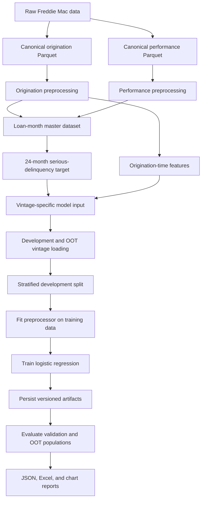

# Mortgage Credit Risk — Project Flow

## Current architecture



## Stage status

| Stage | Status |
|---|---|
| Data ingestion, transformations, and schema validation | Implemented |
| Origination and performance preprocessing | Implemented |
| Target and cohort construction | Implemented |
| Vintage-specific model-input persistence | Implemented |
| Data-quality workbook | Implemented |
| Multi-vintage development and OOT loading | Implemented |
| Stratified development/validation split | Implemented |
| Fitted preprocessing | Implemented |
| Logistic-regression training and artifact persistence | Implemented |
| Validation and OOT evaluation reporting | Implemented |
| Calibration of model probabilities | Future work |
| XGBoost SHAP feature-importance analysis | Implemented |
| Challenger comparison and stability analysis | Future work |

## Leakage boundary

The model is an origination-time model. Origination fields form the predictor population; monthly performance fields are used only to build and validate the future outcome.

```text
Origination date        Performance months 0–24
     |                           |
     |-- model predictors        |-- target observation only
```

The final `model-input` data therefore contains one row per eligible loan, configured origination-time predictors, engineered fields, and `ever_90dpd_24m`.

## Configuration

`config/parameters/base.yml` controls the pipeline.

| Section | Controls |
|---|---|
| `data` | Provider, vintages, ingestion and preprocessing switches, and source feature lists |
| `feature_engineering` | Configured transformations; the current configuration bins credit score, DTI, LTV, and CLTV and log-transforms original UPB |
| `target` | Target name, 90+ DPD threshold, horizon, eligibility age, and voluntary-payoff code |
| `modelling` | Development/OOT vintages, features, split, algorithm, and logistic-regression hyperparameters |
| `evaluation` | Evaluation mode, model version/type, datasets, threshold, deciles, and calibration bins |

`config/catalog/base.yml` defines the data root and artifact locations. The default root is `data/`.

## Modelling populations

Each constructed vintage is persisted separately. The modelling pipeline concatenates configured development vintages and keeps a `vintage` metadata column. It also separately loads configured OOT vintages.

```text
Development vintages -> concatenate -> stratified train / validation split
OOT vintages         -> held outside model fitting -> OOT evaluation
```

The split is configurable and uses `ever_90dpd_24m` for stratification when enabled. A fixed random state makes a given input population reproducible.

## Fitted preprocessing and training

The preprocessor is fitted only on the training population, then applied unchanged to validation and OOT data:

- numeric features: median imputation;
- categorical features: missing values filled with `Unknown`, then one-hot encoded with unknown categories ignored;
- engineered features: passed through.

The configured logistic regression is trained on the transformed training matrix. The model, fitted preprocessor, training metadata, and modelling configuration are persisted under the configured version and algorithm.

## Evaluation artifacts

When evaluation is enabled, the pipeline loads the model artifacts from either the same run or a configured existing model. Existing-artifact evaluation loads the persisted training configuration and uses its saved feature contract for scoring. It evaluates whichever of validation and OOT data are enabled and writes, for each dataset:

- `evaluation_results.json`;
- `evaluation_report.xlsx`;
- `roc.png`, `ks.png`, `risk_deciles.png`, and `calibration.png`.

Evaluation includes classification metrics, ROC-AUC, PR-AUC, KS, Brier score, log loss, confusion matrices, deciles, and calibration results.

When `evaluation.shap.enabled` is true, sampled SHAP analysis is also written below `model_evaluation/shap/<dataset>/`. XGBoost uses TreeExplainer on the raw-margin (log-odds) scale; outputs include SHAP values, aligned transformed-feature values, global feature importance, and metadata.

## Running the pipeline

```python
from pathlib import Path
from credit_risk import run_pipeline

run_pipeline(Path("."))
```

The current configuration reuses existing input datasets by skipping ingestion and preprocessing, then runs modelling and same-run evaluation. Enable only the stages for which the required input datasets or model artifacts exist.
